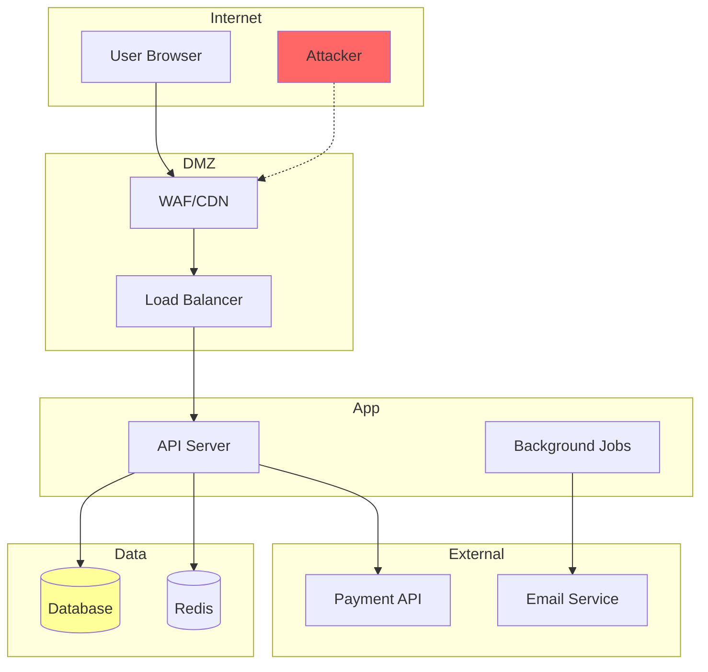

# Skill: Attack Surface Map

**Propósito:** Mapear superfície de ataque e trust boundaries para priorizar análise.

---

## Entradas Esperadas

- [ ] Intake summary
- [ ] Scope definition
- [ ] Código fonte/configs
- [ ] Threat model (opcional)

---

## Saídas

- `attack_surface.md` - Mapa descritivo
- `surface_diagram.mermaid` - Diagrama visual
- `entry_points.yaml` - Lista estruturada

---

## Procedimento

1. **Listar entry points** - APIs, forms, uploads, webhooks
2. **Identificar data stores** - DBs, caches, files, secrets
3. **Mapear trust boundaries** - Onde mudam privilégios
4. **Catalogar integrações** - APIs externas, serviços
5. **Classificar exposição** - Público, autenticado, interno
6. **Gerar diagrama** - Mermaid flowchart
7. **Priorizar** - Por exposição × sensibilidade

---

## Categorias de Entry Points

| Tipo | Exemplos | Risco Base |
|------|----------|------------|
| API REST | /api/* | Alto |
| GraphQL | /graphql | Alto |
| Forms | Login, signup, contact | Médio-Alto |
| File Upload | Avatars, documents | Alto |
| Webhooks | Payment callbacks | Alto |
| WebSocket | Chat, real-time | Médio |
| CLI | Admin commands | Médio |
| Cron/Jobs | Scheduled tasks | Baixo |

---

## Template de Mapa

```markdown
# Attack Surface Map: [Projeto]

## Entry Points

### Públicos (sem auth)
| Endpoint | Método | Input | Sensibilidade |
|----------|--------|-------|---------------|
| /login | POST | JSON | Alta |
| /signup | POST | JSON | Alta |
| /public/* | GET | Query | Baixa |

### Autenticados
| Endpoint | Método | Role Mínimo | Input |
|----------|--------|-------------|-------|
| /api/user | GET | user | - |
| /api/data | POST | user | JSON |

### Admin
| Endpoint | Método | Input | Crítico |
|----------|--------|-------|---------|
| /admin/* | * | Varied | Sim |

## Data Stores
| Store | Tipo | Dados | Exposição |
|-------|------|-------|-----------|
| users_db | PostgreSQL | PII, creds | API |
| cache | Redis | Sessions | Internal |

## Trust Boundaries
1. **Internet → WAF** - Primeiro filtro
2. **WAF → App** - Request processado
3. **App → DB** - Queries executadas
4. **App → External API** - Dados compartilhados

## Integrações Externas
| Serviço | Tipo | Dados Enviados |
|---------|------|----------------|
| Stripe | Payment | Card tokens |
| SendGrid | Email | User emails |
```

---

## Diagrama Mermaid



---

## Output YAML

```yaml
# entry_points.yaml
entry_points:
  public:
    - path: /login
      method: POST
      input_type: json
      priority: high
    - path: /api/public
      method: GET
      input_type: query
      priority: medium

  authenticated:
    - path: /api/user/*
      method: [GET, PUT]
      min_role: user
      priority: medium

  admin:
    - path: /admin/*
      method: "*"
      min_role: admin
      priority: critical

data_stores:
  - name: main_db
    type: postgresql
    contains: [pii, credentials]

trust_boundaries:
  - from: internet
    to: app
    controls: [waf, rate_limit]
```

---

## Critérios de Qualidade

- Todos os endpoints públicos mapeados
- Trust boundaries identificadas
- Dados sensíveis classificados
- Diagrama reflete realidade do código

---

## Token Budget

- **Sugerido:** 4K tokens
- **Máximo:** 8K tokens
- **Reduzir:** Tabelas compactas, diagrama simples

---

## Fallbacks

| Situação | Ação |
|----------|------|
| Sem routes file | Grep por decorators/handlers |
| Framework desconhecido | Buscar padrões comuns |
| Muitos endpoints | Agrupar por prefixo |
| Integrações não documentadas | Buscar HTTP clients no código |
